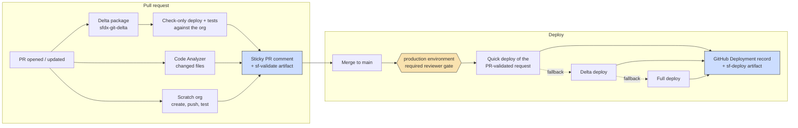

# CI/CD

This repo's pipeline is two thin caller workflows (~25 lines each) over the
reusable Salesforce CI/CD layer in
[shared-github-actions](https://github.com/Gforce-Innovation-Kft/shared-github-actions)
— see its
[consumer guide](https://github.com/Gforce-Innovation-Kft/shared-github-actions/blob/main/docs/consuming-sf-cicd.md)
for the full workflow contracts. Everything below runs on the GitHub **free
tier** (public repo).

## Pipeline



The blue boxes are the **audit trail**: every PR and every deploy leaves a
GitHub Deployment record plus a downloadable artifact.

## Workflows

| File                                                              | Trigger                            | Calls                                                                                                                              |
| ----------------------------------------------------------------- | ---------------------------------- | ---------------------------------------------------------------------------------------------------------------------------------- |
| [`pr-validate.yml`](../.github/workflows/pr-validate.yml)         | `pull_request` → main              | [`sf-validate.yml@v1`](https://github.com/Gforce-Innovation-Kft/shared-github-actions/blob/main/.github/workflows/sf-validate.yml) |
| [`deploy.yml`](../.github/workflows/deploy.yml)                   | `push` → main, `workflow_dispatch` | [`sf-deploy.yml@v1`](https://github.com/Gforce-Innovation-Kft/shared-github-actions/blob/main/.github/workflows/sf-deploy.yml)     |
| [`template-verify.yml`](../.github/workflows/template-verify.yml) | PR + push                          | (self-contained template plumbing — no org access)                                                                                 |

If the pipeline needs a capability the shared workflows lack, raise a change
request on shared-github-actions — never copy workflow logic into this repo.

## Required setup

### 1. Secret

| Secret            | Scope      | Value                                                                                 |
| ----------------- | ---------- | ------------------------------------------------------------------------------------- |
| `DEVHUB_AUTH_URL` | Repository | `sf org display --target-org <alias> --verbose --json \| jq -r '.result.sfdxAuthUrl'` |

Used by both validation (check-only deploys + scratch org creation on the Dev
Hub) and deploy. Hardened variant for real client projects: move it to an
**environment secret** so it only exists behind the gate.

### 2. GitHub Environment

| Environment  | Protection           | Variables                                                               |
| ------------ | -------------------- | ----------------------------------------------------------------------- |
| `production` | Required reviewer(s) | `SF_ORG_ALIAS=production` (optional — defaults to the environment name) |

```bash
gh api -X PUT repos/<org>/<repo>/environments/production \
  --input - <<'JSON'
{ "reviewers": [{ "type": "User", "id": <user-id> }] }
JSON
```

Every merge to main then **waits for approval** before touching the org. With
one org today, `production` maps to the Dev Hub; pointing it at a real
production org later is just replacing the secret — and adding `integration`
/ `uat` environments is one more thin job per environment in `deploy.yml`.

### 3. Branch ruleset on `main`

Require a pull request + the validation status checks, **with "require
branches to be up to date before merging"**. That strict setting is
load-bearing: it forces every PR to re-validate against the top of main, so
the check-only deploy request that quick deploy later consumes is guaranteed
to match what actually merges.

CODEOWNERS review (@gambe94) is enforced on top of the ruleset.

## Quick deploy mechanics

1. The PR's check-only deploy runs the tests and leaves a **validated deploy
   request** on the org; its id travels in `validation.json` inside the
   `sf-validate-<run>` artifact.
2. After merge + gate approval, `sf-deploy.yml` finds that artifact (merge
   commit → PR → head SHA → run), verifies org id + SHA + the 10-day window,
   and runs `sf project deploy quick` — **no tests re-run, seconds instead of
   minutes**.
3. Any mismatch falls back to a delta deploy; an unusable delta base (force
   push, bootstrap) falls back to a full deploy of all package directories.
   The decision is recorded in `quick-deploy-decision.json`.

Bootstrap a fresh org: `gh workflow run deploy.yml -f full-deploy=true`
(deploys `force-app` **and** the fflib/NebulaLogger submodule package
directories).

## Audit trail

_"What exactly went to prod on March 3rd, who approved it, and what tests
ran?"_ — answered from two places, no extra tooling:

- **Deployments sidebar** (repo → Environments → production): every deploy
  with its approver, timestamp, and a direct link to the Salesforce
  deploy-request page.
- **Artifacts** per run: `sf-validate-<run>` (delta manifest, validation
  result, quick-deploy handoff) and `sf-deploy-production-<run>` (delta
  manifest, deploy result JSON, JUnit test results, quick-deploy decision).

**Retention caveat:** artifacts live for 90 days (the free-tier maximum,
already configured). For regulated projects, export artifacts to S3/object
storage on a schedule as the long-term audit store — that is the enterprise
upgrade path; deliberately not built here.

## Migration note (July 2026)

The previous inline workflows (`validate-pr.yml`, `deploy-staging.yml`,
`deploy-production.yml`) and their `STAGING_AUTH_URL` / `PRODUCTION_AUTH_URL`
secrets are gone. `DEVHUB_AUTH_URL` is the only secret; environments replace
per-org secrets as the promotion mechanism.
