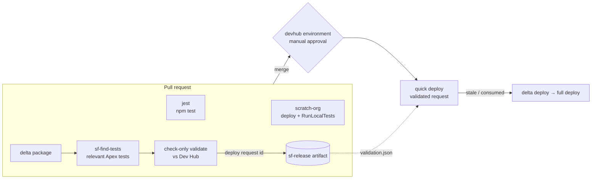

# CI/CD Pipeline

Trunk-based flow against a single Dev Hub (production) org. Two thin
workflows call the reusable layer in
[shared-github-actions](https://github.com/Gforce-Innovation-Kft/shared-github-actions)
at the `v1` release tag — all pipeline logic is versioned there.

## Flow

**PR Validate** (`pr-validate.yml` → `sf-pr-validate.yml@v1`)

- `jest` — runs `npm test` (skips with a notice if no test script exists).
- `scratch-org` — 1-day scratch org from `config/scratch-orgs/ci.json`:
  deploy, assign permission sets, `RunLocalTests` with coverage, always
  deleted.

**Release** (`release.yml` → `sf-release.yml@v1`)

- On PR: delta `package.xml` (sfdx-git-delta) → `sf-find-tests` selects the
  Apex tests covering the changed classes (naming match + reference scan) →
  check-only deploy against the Dev Hub (`RunSpecifiedTests`; falls back to
  `RunLocalTests` when Apex changed but no tests matched; no tests for
  metadata-only deltas). The deploy request id is saved in the
  `sf-release-<run_number>` artifact.
- On merge: the `quick-deploy` job waits for approval on the `devhub`
  environment, then runs `sf project deploy quick` with the validated
  request — no tests re-run, the org accepts the already-validated
  package. Fallbacks: delta deploy (same recorded test plan) → full deploy
  of every `packageDirectories` entry. Manual bootstrap:
  `gh workflow run release.yml -f full-deploy=true`.

## Why quick deploy is safe here

The `main` ruleset requires branches to be up to date before merging, so
the merged tree is identical to the validated PR head. The deploy job
additionally checks: same org id, same head SHA, validation younger than
10 days — otherwise it falls back to a real deploy.

## Required setup

| Piece             | Value                                                                                     |
| ----------------- | ----------------------------------------------------------------------------------------- |
| Repo secret       | `DEVHUB_AUTH_URL` — SFDX auth URL of the Dev Hub                                          |
| Environment       | `devhub`, required reviewer = release manager                                             |
| Ruleset on `main` | require PR, require `jest` / `scratch-org` / `validate` checks, require branch up to date |

## Audit trail

Every run leaves artifacts (90-day retention by default): the delta
manifest and generated source, the validate/deploy results, the selected
tests, and `quick-deploy-decision.json` recording why quick deploy was or
was not used. Deployments to `devhub` also appear in the repo's
Deployments sidebar (recorded automatically by the environment binding).
For longer retention, sync artifacts to external storage (e.g. S3) from a
scheduled workflow.

## Limitations

- Fork PRs fail validation (secrets are not exposed to forks) — use
  same-repo branches.
- Approving a deploy more than 10 days after validation falls back to a
  full delta redeploy (tests re-run).
